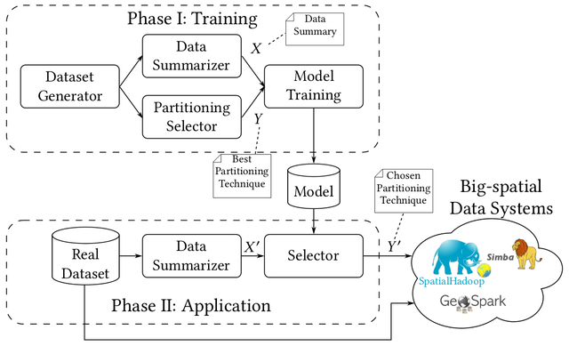
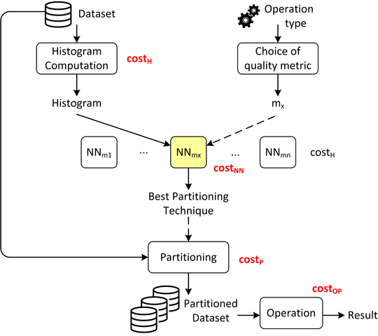

# README #

### What is this repository for? ###

* This project provide a framework for data preparation, training and testing deep learning models for big spatial data partitioning.
* Version: 0.1

### How to deploy your own models using our framework? ###

* [Dataset generators](#dataset-generators)
* [Collect data for training and testing](#collect-data-for-training-and-testing)
* [Preprocessing](#preprocessing)
* [Train and test the model](#train-and-test-the-model)
* [Use the pre-trained model in your system](#use-the-pre-trained-model-in-your-system)



### Dataset generators ###
* **Option 1**: We published [a paper](http://www.cs.ucr.edu/~eldawy/publications/19_SpatialGems.pdf) at [SpatialGems 2019](https://www.spatialgems.net/) about spatial data generators. 
 The generators allow you to create synthetic spatial datasets with your desired distribution and dataset size. 
 The source code is available at [this repository](https://github.com/tinvukhac/spatialdatagenerators).

* **Option 2**: You could use your own spatial datasets to generate training and testing data for next steps. 

### Collect data for training and testing ###
* In this project, we will demonstrate how to apply our deep leearning models to improve the partitioning performance of [SpatialHadoop](http://spatialhadoop.cs.umn.edu/). 
However, the following steps will not only be applicable for SpatialHadoop but also other systems such as LocationSpark, GeoSpark, Simba, etc.  

* In order to get a better performance, we have been creating a Spark implementation of SpatialHadoop, called Beast. 
The source code of Beast is available at [this repository](https://bitbucket.org/eldawy/beast/src/master/).

 
* **Data summarizer**: We implemented 'histogram' command, which computes the histogram of a spatial dataset in your desired size.
For example, assume that your have a dataset of points, named 'points_dataset.csv', the following shell command will compute the histogram with size 20x20.

```console
foo@bar:~$ spark-submit beast-uber-spark-0.2.2-SNAPSHOT.jar histogram points_dataset.csv points_dataset.hist 'iformat:point(1,2)' separator:, shape:20,20 -overwrite
```

The output is points_dataset.hist, which contains the histogram of the given dataset.

* **Partitioning selector**: In Beast (SpatialHadoop), a partitioning scheme includes the metadata of partitioned files, e.g. file name, file size, number of records, MBR coordinates.
We could use this metadata to compute several quality metrics such as total partition area, total partition margin, load balance between partitions, etc.

The question is that given the points_dataset.csv above and many partitioning techniques as R*-Tree, STR, Kd-Tree, Z-Curve, etc, how can we know which technique is the best one to partition your dataset?
A naive solution is that we can partition the dataset using all techniques, collect the corresponding partition metadata, then evaluate them based on the quality metrics. Unfortunately, physical partitioning requires a lot of effort, which makes this solution being not practical. 

We addressed this problem by providing a new command, named 'mindex'. This command allows you to compute the metadata of partitions for different partitioning techniques **without physical partitioning**, which is significantly faster than the previous solution.   

```console
foo@bar:~$ spark-submit beast-uber-spark-0.2.2-SNAPSHOT.jar mindex points_dataset.csv points_dataset_masters gindexes:rsgrove,str,kdtree,zcurve 'iformat:point(1,2)' separator:, 
```

The output directory 'points_dataset_masters' will contain the partition metadata for all techniques: R*-Tree, STR, Kd-Tree and Z-Curve.

### Preprocessing ###
After collect the histogram and the metadata for all partitioning techniques. We can create one data point for the training/testing purpose as follows:
* Extract and flatten histogram: get the histogram of the dataset and flatten it to a vector.
* Compute the best technique in a specific quality metric: compute the quality metrics of partitioned files in different partitioning techniques.

Those functions could be found in 'preprocessing.py'.

So far, given a dataset, we are able to generate a data point (X, ys) with X is the histogram vector and ys is the label of the best partitioning technique in terms of a specific quality metric. 
We do this process for thousand of datasets in different histogram sizes.
These data points are stored at 'data/train_and_test'. 
We will use these data points for our training and testing purpose. 

### Train and test the model ###
* Configure your train and test data and use the 'model.py' to train your model.
* The final output of the training process should be store at 'models' directory.

### Use the pre-trained model in your system ###
* Once you got a pre-trained model that allow you to predict the best partitioning technique in terms of a specific quality metrics, you could easily integrate this model into your partitioning process.
* The script 'smart_partitioning.py' demonstrate how we can use this pre-trained model to automatically choose the best partitioning technique for a spatial dataset using Beast.
- **Step 1**: Compute dataset histogram
- **Step 2**: Choose the targeted quality metric to optimize.
- **Step 3**: Extract the histogram vector from the output of step 1.
- **Step 4**: Given the histogram vector, predict the best partitioning technique using the pre-trained model.
- **Step 5**: Use the suggested model to physically partition your dataset.

 <!-- .element height="50%" width="50%" -->

### Contact ###

* Repo owner: tvu032@ucr.edu